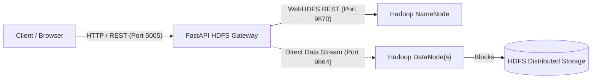
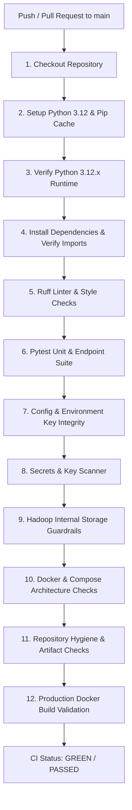
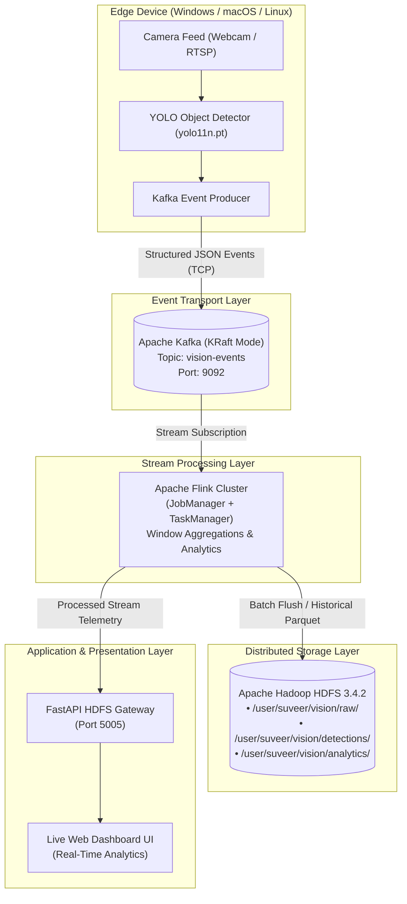

# 🐘 FastAPI HDFS Gateway

An asynchronous REST API gateway and web management interface built with **FastAPI** to interact with an **existing Apache Hadoop HDFS (Hadoop Distributed File System)** cluster via **WebHDFS**.

---

## 📑 Table of Contents

1. [Project Overview](#1-project-overview)
2. [Complete System Architecture](#2-complete-system-architecture)
3. [Project Structure](#3-project-structure)
4. [macOS Development Environment](#4-macos-development-environment)
5. [Git & GitHub Workflow](#5-git--github-workflow)
6. [Linux VM Setup & Preparation](#6-linux-vm-setup--preparation)
7. [Setting Up Hadoop with Cloudera Sandbox (Optional Alternative)](#7-setting-up-hadoop-with-cloudera-sandbox-optional-alternative)
8. [Existing Hadoop Installation Environment](#8-existing-hadoop-installation-environment)
9. [How to Start & Manage Hadoop](#9-how-to-start--manage-hadoop)
10. [WebHDFS Configuration & Protocol Lifecycle](#10-webhdfs-configuration--protocol-lifecycle)
11. [Docker Deployment Architecture](#11-docker-deployment-architecture)
12. [Environment Configuration Reference](#12-environment-configuration-reference)
13. [REST API Documentation & Endpoints](#13-rest-api-documentation--endpoints)
14. [End-to-End Deployment Guide](#14-end-to-end-deployment-guide)
15. [End-to-End Verification & Testing](#15-end-to-end-verification--testing)
16. [Comprehensive Troubleshooting Guide](#16-comprehensive-troubleshooting-guide)
17. [Security Model & Hardening](#17-security-model--hardening)
18. [Production & Deployment Notes](#18-production--deployment-notes)
19. [Common Command Reference](#19-common-command-reference)
20. [Verification & Conformance Report](#20-verification--conformance-report)
21. [CI/CD Pipeline & GitHub Guardrails](#21-cicd-pipeline--github-guardrails)
22. [Real-Time Streaming Pipeline (v2 Architecture)](#22-real-time-streaming-pipeline-v2-architecture)

---

## 1. Project Overview

### What the Project Is
The **FastAPI HDFS Gateway** is a containerized Python API layer and lightweight web user interface providing programmatic and browser-based HTTP access to an existing **Apache Hadoop HDFS** installation.

### Why the Gateway Exists
Interacting directly with Hadoop HDFS typically requires:
* Shell / SSH access to the Hadoop nodes.
* Installation of the heavy Java-based Hadoop CLI (`hdfs dfs`).
* Complex client-side configuration (`core-site.xml`, `hdfs-site.xml`).

This gateway decouples applications and users from raw Hadoop command-line tools by offering a clean, standard REST interface (`/api/v1`) for file lifecycle operations: **uploading, streaming downloads, directory creation, listing metadata, and path deletion**.

### What the Gateway Is NOT
* **Not a Hadoop distribution:** The gateway does **not** replace, build, or deploy Hadoop.
* **Not a mock or simulation engine:** The gateway does **not** simulate HDFS locally and contains zero fake storage logic.
* **Not a local storage store:** The gateway does **not** retain uploaded or downloaded files on its local container disk. It streams data directly to and from Hadoop DataNodes over HTTP.
* **Hadoop is an external dependency:** Apache Hadoop runs as independent infrastructure on the Linux host/cluster.



---

## 2. Complete System Architecture

### Runtime Communication Architecture

```text
┌─────────────────────────────────────────────────────────┐
│                    Client / Browser                     │
└────────────────────────────┬────────────────────────────┘
                             │ HTTP Requests (Port 5005)
                             ▼
┌─────────────────────────────────────────────────────────┐
│            FastAPI HDFS Gateway (Port 5005)             │
│  ┌───────────────────────────────────────────────────┐  │
│  │ app/main.py (FastAPI App & Jinja2 UI)             │  │
│  └─────────────────────────┬─────────────────────────┘  │
│                            │                            │
│  ┌─────────────────────────▼─────────────────────────┐  │
│  │ app/api/endpoints.py (/api/v1/* routes)           │  │
│  └─────────────────────────┬─────────────────────────┘  │
│                            │                            │
│  ┌─────────────────────────▼─────────────────────────┐  │
│  │ app/services/hdfs_service.py (HDFSService Client) │  │
│  └─────────────────────────┬─────────────────────────┘  │
└────────────────────────────┼────────────────────────────┘
                             │ WebHDFS Protocol
                             ▼
┌─────────────────────────────────────────────────────────┐
│                 Hadoop Infrastructure                   │
│                                                         │
│   ┌─────────────────────────────────────────────────┐   │
│   │ Hadoop NameNode (WebHDFS Port 9870)             │   │
│   │ • Metadata, namespace, and 307 redirects        │   │
│   └────────────────────────┬────────────────────────┘   │
│                            │ DataNode HTTP Redirection   │
│   ┌────────────────────────▼────────────────────────┐   │
│   │ Hadoop DataNode(s) (Block Transfer Port 9864)   │   │
│   │ • Binary chunk upload & stream download         │   │
│   └────────────────────────┬────────────────────────┘   │
│                            │ Block Storage              │
│   ┌────────────────────────▼────────────────────────┐   │
│   │ HDFS Physical Storage Directory                 │   │
│   └─────────────────────────────────────────────────┘   │
└─────────────────────────────────────────────────────────┘
```

### Engineering & Deployment Flow

```text
┌──────────────────────────────────────┐
│           macOS Workstation          │
│   • FastAPI & service development    │
│   • Local unit testing (pytest)      │
│   • Code quality checks (ruff)       │
└──────────────────┬───────────────────┘
                   │ git push origin main
                   ▼
┌──────────────────────────────────────┐
│           GitHub Repository          │
│   Suveer-Upasani/HDFS_Gateway        │
└──────────────────┬───────────────────┘
                   │ git pull origin main
                   ▼
┌──────────────────────────────────────────────────────┐
│                   Linux VM Host                      │
│                                                      │
│  ┌────────────────────────┐  ┌────────────────────┐  │
│  │ Docker Gateway App     │  │ Existing Hadoop    │  │
│  │ (network_mode: host)   │  │ Version 3.4.2      │  │
│  │ • FastAPI on :5005     │  │ • NameNode :9870   │  │
│  │ • Python 3.12-slim     │  │ • DataNode :9864   │  │
│  └───────────┬────────────┘  └─────────▲──────────┘  │
│              │                         │             │
│              └──── localhost:9870 ─────┘             │
└──────────────────────────────────────────────────────┘
```

* **On macOS:** Development, test suites, static analysis, and version control operations.
* **On Linux VM:** Hosting the production Apache Hadoop cluster and running the containerized FastAPI Gateway via Docker Compose with `network_mode: host`.

---

## 3. Project Structure

```
.
├── app/
│   ├── __init__.py                 # Package initializer
│   ├── main.py                     # FastAPI application, CORS middleware, Jinja2 template mounting
│   ├── api/
│   │   ├── __init__.py             # API package initializer
│   │   ├── endpoints.py            # REST API endpoints (/api/v1/health, list, upload, download, mkdir, delete)
│   │   └── vision.py               # Real-time streaming API router (v2 scaffolding)
│   ├── core/
│   │   ├── __init__.py             # Core package initializer
│   │   └── config.py               # Pydantic BaseSettings environment configuration loader
│   ├── services/
│   │   ├── __init__.py             # Services package initializer
│   │   └── hdfs_service.py         # Async WebHDFS client communicating with Hadoop NameNode & DataNode
│   └── templates/
│       └── index.html              # Management UI dashboard with drag-and-drop upload & explorer
├── vision_client/
│   ├── __init__.py                 # Vision client package initializer
│   ├── config.py                   # Pydantic settings for camera source, YOLO model, and Kafka broker
│   ├── events.py                   # DetectionEvent schema and serialization data contract
│   ├── camera.py                   # Cross-platform camera capture interface (Windows/macOS/Linux)
│   ├── detector.py                 # Ultralytics YOLO inference engine & detection parser
│   ├── kafka_producer.py           # Kafka JSON event publishing client
│   └── runner.py                   # Real-time capture, inference, and streaming orchestration runner
├── streaming/
│   ├── kafka/
│   │   └── README.md               # Kafka KRaft transport layer architecture, persistent volume, & topic guides
│   └── flink/
│       ├── README.md               # Apache Flink stream processing cluster architecture & management
│       └── jobs/
│           ├── __init__.py         # Flink streaming jobs package initializer
│           ├── object_counting_job.py # Real-time 10-second tumbling window object counting job
│           ├── window_aggregator.py   # Event-time tumbling window aggregation engine
│           └── README.md           # Flink job specifications, execution commands, & schema contracts
├── tests/
│   ├── __init__.py                 # Test package initializer
│   ├── test_health.py              # Asynchronous unit test suite for FastAPI Gateway endpoints
│   ├── test_vision_client.py       # Unit tests for vision client configs, event contracts, and interfaces
│   └── test_flink_jobs.py          # Unit tests for Flink window aggregations, timestamps, and watermarks
├── .env.example                    # Template environment variable configuration (safe to commit)
├── .gitignore                      # Git ignore rules for Python, caches, and environment files
├── Dockerfile                      # Production container image definition (Python 3.12-slim)
├── docker-compose.yml              # HDFS Gateway container orchestration with host networking
├── docker-compose.streaming.yml    # Kafka (KRaft) and Apache Flink streaming infrastructure compose file
├── Makefile                        # Development and operational command shortcuts
├── requirements.txt                # Production application dependencies
├── requirements-dev.txt            # Development, linting, and testing dependencies
└── README.md                       # Comprehensive system and deployment documentation
```

### Module Responsibilities

| File | Purpose |
| :--- | :--- |
| [`app/main.py`](file:///Users/suveer/HDFS/app/main.py) | Application root. Instantiates the FastAPI application, mounts templates and static files, configures CORS, and registers API routers. |
| [`app/api/endpoints.py`](file:///Users/suveer/HDFS/app/api/endpoints.py) | Defines all HTTP endpoints under `/api/v1`. Validates incoming requests, sanitizes paths, and dispatches calls to the service layer. |
| [`app/api/vision.py`](file:///Users/suveer/HDFS/app/api/vision.py) | Router scaffolding for future real-time streaming analytics and active camera status endpoints. |
| [`app/core/config.py`](file:///Users/suveer/HDFS/app/core/config.py) | Pydantic `BaseSettings` class loading configuration from environment variables and `.env` files with strict typing and defaults. |
| [`app/services/hdfs_service.py`](file:///Users/suveer/HDFS/app/services/hdfs_service.py) | Encapsulates all WebHDFS protocol mechanics: path sanitization, HTTP redirects (307), chunked streaming downloads, and error handling. |
| [`app/templates/index.html`](file:///Users/suveer/HDFS/app/templates/index.html) | Single-page management UI with live cluster connectivity status, drag-and-drop upload, and folder navigation. |
| [`vision_client/events.py`](file:///Users/suveer/HDFS/vision_client/events.py) | Structured typed Pydantic data contract (`DetectionEvent`) used across the edge client, Kafka, Flink, and FastAPI. |
| [`vision_client/config.py`](file:///Users/suveer/HDFS/vision_client/config.py) | Edge vision settings for camera ID, video source, Kafka broker host, YOLO model weight path, and confidence threshold. |
| [`vision_client/camera.py`](file:///Users/suveer/HDFS/vision_client/camera.py) | Abstract camera stream interface and OpenCV wrapper supporting cross-platform webcams, RTSP, and video files. |
| [`vision_client/detector.py`](file:///Users/suveer/HDFS/vision_client/detector.py) | Ultralytics YOLO detector extracting bounding boxes, class labels, and confidence metrics into structured detection events. |
| [`vision_client/kafka_producer.py`](file:///Users/suveer/HDFS/vision_client/kafka_producer.py) | Kafka JSON event publisher transmitting structured `DetectionEvent` records to Kafka topics. |
| [`vision_client/runner.py`](file:///Users/suveer/HDFS/vision_client/runner.py) | Application runner orchestrating real-time camera capture, YOLO detection, and Kafka streaming with graceful shutdown. |
| [`docker-compose.streaming.yml`](file:///Users/suveer/HDFS/docker-compose.streaming.yml) | Orchestrates Kafka in KRaft mode with persistent volume storage (`kafka_data`) and Apache Flink (JobManager + TaskManager). |
| [`streaming/flink/jobs/object_counting_job.py`](file:///Users/suveer/HDFS/streaming/flink/jobs/object_counting_job.py) | Real-time streaming consumer computing event-time 10-second tumbling window object aggregations from Kafka. |
| [`streaming/flink/jobs/window_aggregator.py`](file:///Users/suveer/HDFS/streaming/flink/jobs/window_aggregator.py) | Pure Python event-time window aggregation engine with watermark tracking and JSON serialization. |
| [`tests/test_health.py`](file:///Users/suveer/HDFS/tests/test_health.py) | Asynchronous test suite verifying dashboard rendering, health endpoint, directory listings, uploads, and path traversal security. |
| [`tests/test_vision_client.py`](file:///Users/suveer/HDFS/tests/test_vision_client.py) | Unit tests verifying detection event validation, settings defaults, and vision client interfaces. |
| [`tests/test_flink_jobs.py`](file:///Users/suveer/HDFS/tests/test_flink_jobs.py) | Unit tests verifying Flink timestamp parsing, 10s window bounds calculation, watermark emission, and event aggregation. |
| [`Dockerfile`](file:///Users/suveer/HDFS/Dockerfile) | Multi-stage, security-hardened `python:3.12-slim` image configured with curl health checks and unbuffered logging. |
| [`docker-compose.yml`](file:///Users/suveer/HDFS/docker-compose.yml) | Runs the gateway container using `network_mode: host` to directly bind to the host's Hadoop services. |
| [`Makefile`](file:///Users/suveer/HDFS/Makefile) | Standard command shortcuts (`make dev`, `make run`, `make test`, `make docker-build`). |

---

## 4. macOS Development Environment

Local development on macOS allows testing the FastAPI application, static analysis, and test suites without modifying or running Hadoop locally.

### 1. Prerequisites Check
Verify that Python 3.12+ and Git are installed on macOS:
```bash
python3 --version
git --version
```

### 2. Clone Repository & Setup Virtual Environment
```bash
# Navigate to workspace
cd ~/HDFS

# Create a dedicated Python 3.12 virtual environment
python3 -m venv .venv

# Activate the virtual environment
source .venv/bin/activate

# Upgrade pip
pip install --upgrade pip
```

### 3. Install Dependencies
```bash
# Install production and development dependencies
pip install -r requirements-dev.txt
```

### 4. Configure Local Environment
Create your local `.env` configuration file from the template:
```bash
cp .env.example .env
```

Ensure `.env` contains:
```env
APP_NAME=HDFS Gateway API
APP_ENV=development
DEBUG=true
HOST=0.0.0.0
PORT=5005
HDFS_NAMENODE_URL=http://localhost:9870
HDFS_USER=suveer
HDFS_DEFAULT_DIR=/
HDFS_TIMEOUT_SECONDS=30
```

### 5. Run Static Analysis & Tests
```bash
# Run Ruff linting and formatting check
ruff check .

# Run unit test suite
pytest -v
```

### 6. Start Development Server
```bash
# Run FastAPI with auto-reload enabled
make dev
# Alternatively:
uvicorn app.main:app --host 0.0.0.0 --port 5005 --reload
```

* **Web UI Dashboard:** Open [http://localhost:5005](http://localhost:5005)
* **Interactive OpenAPI (Swagger) Docs:** Open [http://localhost:5005/docs](http://localhost:5005/docs)
* **ReDoc Documentation:** Open [http://localhost:5005/redoc](http://localhost:5005/redoc)

> [!NOTE]
> When running locally on macOS without a live Hadoop cluster, unit tests pass via mocked network fixtures. Live cluster calls to `/api/v1/files/list` will return `503 Service Unavailable` with a descriptive message until deployed to the Linux VM hosting Hadoop.

---

## 5. Git & GitHub Workflow

A strict Git hygiene policy ensures sensitive data and machine-specific artifacts are never committed.

### Workflow Commands

```bash
# 1. Check current repository status
git status

# 2. Stage modified files
git add app/ tests/ Dockerfile docker-compose.yml Makefile requirements.txt requirements-dev.txt .env.example .gitignore README.md

# 3. Commit changes
git commit -m "Production-ready HDFS API gateway"

# 4. Push to GitHub main branch
git push origin main
```

On the Linux deployment machine:
```bash
# Pull latest updates
git pull origin main
```

### Git Hygiene Rules
* **Never commit `.env`:** [.gitignore](file:///Users/suveer/HDFS/.gitignore) explicitly excludes `.env` and `.env.local`.
* **Safe configuration:** Only commit [.env.example](file:///Users/suveer/HDFS/.env.example).
* **Excluded directories:** `.venv/`, `__pycache__/`, `.pytest_cache/`, `.ruff_cache/`, and log files are ignored.
* **Verify ignored files:**
  ```bash
  git ls-files .env
  # (Must return empty output)
  ```

---

## 6. Linux VM Setup & Preparation

The gateway is designed to deploy onto a Linux Virtual Machine (such as Ubuntu 22.04 / 24.04 LTS under VMware Workstation / Fusion / ESXi).

### 1. Verify Linux System Resources & Packages
Run the following commands on the Linux VM to verify system specs and dependencies:

```bash
# Check kernel and architecture
uname -a

# Check Linux distribution details
lsb_release -a || cat /etc/os-release

# Check available memory (Recommended: 4GB+ RAM for Hadoop + Gateway)
free -h

# Check disk space (Recommended: 20GB+ free)
df -h

# Check Git installation
git --version

# Check Docker installation
docker --version

# Check Docker Compose plugin
docker compose version
```

### 2. Install Docker & Docker Compose on Linux (If Missing)
If Docker is not installed on your Linux machine:
```bash
# Update package lists
sudo apt-get update

# Install Docker prerequisites
sudo apt-get install -y ca-certificates curl gnupg

# Add Docker official GPG key
sudo install -m 0755 -d /etc/apt/keyrings
curl -fsSL https://download.docker.com/linux/ubuntu/gpg | sudo gpg --dearmor -o /etc/apt/keyrings/docker.gpg
sudo chmod a+r /etc/apt/keyrings/docker.gpg

# Add Docker repository
echo \
  "deb [arch=$(dpkg --print-architecture) signed-by=/etc/apt/keyrings/docker.gpg] https://download.docker.com/linux/ubuntu \
  $(. /etc/os-release && echo "$VERSION_CODENAME") stable" | \
  sudo tee /etc/apt/sources.list.d/docker.list > /dev/null

# Install Docker Engine and Compose
sudo apt-get update
sudo apt-get install -y docker-ce docker-ce-cli containerd.io docker-buildx-plugin docker-compose-plugin

# Enable current user to run Docker without sudo
sudo usermod -aG docker $USER
newgrp docker
```

---

## 7. Setting Up Hadoop with Cloudera Sandbox (Optional Alternative)

> [!IMPORTANT]
> This section is strictly an **optional reference guide** for developers seeking a pre-packaged Hadoop sandbox for experimentation. The FastAPI HDFS Gateway project runs against any standard Apache Hadoop installation and does **not** require Cloudera Sandbox.

Cloudera provides pre-configured single-node evaluation VMs (e.g., Cloudera QuickStart / Cloudera Data Platform Private Cloud Sandbox) distributed as VMware / VirtualBox images or Docker containers.

### Step 1: Download the Sandbox Image
1. Visit the [Cloudera Downloads Archive](https://www.cloudera.com/downloads.html).
2. Select the **VMware (VMX / OVA)** package corresponding to your target platform.
3. Download and extract the archive on your hypervisor host.

### Step 2: VMware Resource Allocation
Allocate sufficient hardware resources to ensure all Hadoop daemon processes (NameNode, DataNode, NodeManager, ResourceManager) initialize reliably:
* **Memory:** Minimum **8 GB** (Recommended: **12 GB – 16 GB**).
* **CPU:** Minimum **2 cores** (Recommended: **4 vCPUs**).
* **Network Adapter:** **Bridged** or **Host-Only** with a dedicated static IP address.

### Step 3: Start & Access the Sandbox VM
1. Power on the VM in VMware.
2. Allow 5–10 minutes for all services to start.
3. Obtain the VM's assigned IP address from the console:
   ```bash
   ip addr show
   ```
4. Log in via SSH:
   ```bash
   ssh cloudera@<SANDBOX_IP>
   # Default credentials vary by version (commonly cloudera / cloudera or root / cloudera)
   ```

### Step 4: Verify Hadoop Installation & Environment
```bash
# Locate Hadoop binaries
which hdfs
which hadoop

# Check Hadoop version (Version is release-dependent)
hdfs version

# Verify running Java processes (NameNode, DataNode should be present)
jps
```

### Step 5: Verify & Enable WebHDFS in Sandbox
Check if WebHDFS is enabled in `/etc/hadoop/conf/hdfs-site.xml`:
```xml
<property>
    <name>dfs.webhdfs.enabled</name>
    <value>true</value>
</property>
```

Verify WebHDFS access via `curl`:
```bash
# Standard NameNode WebHDFS port is 9870 (Hadoop 3.x) or 50070 (Hadoop 2.x)
curl -s "http://localhost:9870/webhdfs/v1/?op=GETFILESTATUS&user.name=hdfs"
```

---

## 8. Existing Hadoop Installation Environment

This section documents the known configuration of the Linux host where Hadoop 3.4.2 is deployed.

### Environment Parameters

| Parameter | Known Path / Value |
| :--- | :--- |
| **Hadoop Version** | `3.4.2` |
| **`HADOOP_HOME`** | `/opt/hadoop` |
| **`HADOOP_CONF_DIR`** | `/opt/hadoop/etc/hadoop` |
| **HDFS NameNode Storage** | `/home/suveer/hadoopdata/hdfs/namenode` |
| **HDFS DataNode Storage** | `/home/suveer/hadoopdata/hdfs/datanode` |
| **Primary HDFS User** | `suveer` |
| **NameNode HTTP Port** | `9870` |
| **DataNode HTTP Port** | `9864` |

> [!CAUTION]
> **CRITICAL WARNING:** Never manually modify, delete, or add files directly inside the physical NameNode (`/home/suveer/hadoopdata/hdfs/namenode`) or DataNode (`/home/suveer/hadoopdata/hdfs/datanode`) storage directories. These directories contain Hadoop internal block files, transaction logs, and metadata fsimages. All interactions must proceed through Hadoop CLI commands (`hdfs dfs`) or the WebHDFS REST API.

---

## 9. How to Start & Manage Hadoop

Execute these operational commands on the Linux VM to manage Hadoop services.

### 1. Verify Environment Variables
Ensure Hadoop environment variables are loaded in `~/.bashrc` or current shell:
```bash
export HADOOP_HOME=/opt/hadoop
export HADOOP_CONF_DIR=$HADOOP_HOME/etc/hadoop
export PATH=$PATH:$HADOOP_HOME/bin:$HADOOP_HOME/sbin
```

### 2. Check If Hadoop Services Are Running
```bash
# Check active Java daemon processes
jps
```
Expected output includes:
* `NameNode`
* `DataNode`
* `SecondaryNameNode`

### 3. Start Hadoop HDFS Daemons
```bash
# Start NameNode and DataNodes
$HADOOP_HOME/sbin/start-dfs.sh
```

### 4. Verify HDFS Filesystem Health
```bash
# Check HDFS root listing
hdfs dfs -ls /

# Check HDFS cluster report and capacity
hdfs dfsadmin -report
```

### 5. Verify NameNode Web Interface
Open a browser or use curl to check the NameNode web UI:
* URL: `http://<LINUX_VM_IP>:9870`
* Curl check:
  ```bash
  curl -I http://localhost:9870/dfshealth.html
  ```

### 6. Safely Stop Hadoop HDFS
```bash
# Stop all HDFS daemons
$HADOOP_HOME/sbin/stop-dfs.sh
```

---

## 10. WebHDFS Configuration & Protocol Lifecycle

### What WebHDFS Is
**WebHDFS** is the standard Apache Hadoop REST API specification. It provides full, secure HTTP/HTTPS access to HDFS filesystem operations using standard HTTP verbs (`GET`, `PUT`, `POST`, `DELETE`).

### Verifying WebHDFS Configuration in `hdfs-site.xml`
Inspect `$HADOOP_CONF_DIR/hdfs-site.xml` to ensure WebHDFS is active:
```xml
<configuration>
    <property>
        <name>dfs.webhdfs.enabled</name>
        <value>true</value>
    </property>
</configuration>
```

### The 2-Step Upload Protocol Lifecycle
Unlike simple file servers, Hadoop distributes file blocks across DataNodes. WebHDFS implements a **two-step redirect protocol** for file creation:

```text
FastAPI Gateway              Hadoop NameNode               Hadoop DataNode
      │                            │                             │
      │ 1. PUT /webhdfs/v1/file    │                             │
      │    ?op=CREATE              │                             │
      ├───────────────────────────>│                             │
      │                            │                             │
      │ 2. HTTP 307 Temporary      │                             │
      │    Redirect (Location:     │                             │
      │    http://datanode:9864)   │                             │
      │<───────────────────────────┤                             │
      │                                                          │
      │ 3. PUT binary file stream to DataNode Location           │
      ├─────────────────────────────────────────────────────────>│
      │                                                          │
      │ 4. HTTP 201 Created                                      │
      │<─────────────────────────────────────────────────────────┤
```

1. **Step 1:** The Gateway issues a `PUT` request to the NameNode with `op=CREATE`.
2. **Step 2:** The NameNode selects candidate DataNodes and responds with `HTTP 307 Temporary Redirect` containing the target DataNode URL in the `Location` header.
3. **Step 3:** The Gateway streams the file content directly to the DataNode URL.
4. **Step 4:** The DataNode commits the blocks to disk and returns `HTTP 201 Created`.

### Direct WebHDFS Verification with Curl
```bash
# Verify NameNode status endpoint
curl -s "http://localhost:9870/webhdfs/v1/?op=GETFILESTATUS&user.name=suveer"

# Verify Root Directory Listing
curl -s "http://localhost:9870/webhdfs/v1/?op=LISTSTATUS&user.name=suveer" | jq .
```

---

## 11. Docker Deployment Architecture

### Container Contents
The Docker image is built using `python:3.12-slim`:
* **Included:** Python runtime, FastAPI, Uvicorn, httpx, Jinja2, and application gateway code.
* **Excluded:** No Hadoop binaries, no Java runtime, no Hadoop configuration files, and no HDFS block storage.

### Why `network_mode: host` Is Used
In `docker-compose.yml`, the gateway uses `network_mode: host`:
```yaml
services:
  hdfs-gateway:
    build:
      context: .
      dockerfile: Dockerfile
    container_name: hdfs-gateway
    network_mode: host
    environment:
      APP_NAME: HDFS Gateway API
      APP_ENV: production
      DEBUG: "false"
      HOST: 0.0.0.0
      PORT: 5005
      HDFS_NAMENODE_URL: ${HDFS_NAMENODE_URL:-http://localhost:9870}
      HDFS_USER: ${HDFS_USER:-suveer}
      HDFS_DEFAULT_DIR: /
      HDFS_TIMEOUT_SECONDS: 30
    restart: unless-stopped
```

**Benefits of Host Networking:**
1. Allows the containerized Gateway on the Linux VM to communicate directly with `localhost:9870` (NameNode) and `localhost:9864` (DataNode) without complex bridge port-forwarding or NAT redirection issues during the 307 redirect phase.
2. Zero network overhead between the REST API and the local Hadoop daemons.

### Docker Operational Commands

```bash
# Build the Docker image
docker build -t hdfs-gateway:latest .

# Launch service in background via Docker Compose
docker compose up --build -d

# View real-time container logs
docker compose logs -f

# Check container status
docker compose ps

# Stop and remove container
docker compose down
```

---

## 12. Environment Configuration Reference

Configuration is managed via Pydantic `BaseSettings` in [`app/core/config.py`](file:///Users/suveer/HDFS/app/core/config.py). All parameters read from system environment variables with fallback defaults.

| Environment Variable | Default Value | Type | Description |
| :--- | :--- | :---: | :--- |
| `APP_NAME` | `HDFS Gateway API` | `str` | Application title displayed in UI and Swagger docs. |
| `APP_ENV` | `production` | `str` | Application environment (`development` or `production`). |
| `DEBUG` | `false` | `bool` | Enables FastAPI debug mode and auto-reloader. |
| `HOST` | `0.0.0.0` | `str` | Network interface address the gateway binds to. |
| `PORT` | `5005` | `int` | TCP port exposed by the gateway. |
| `HDFS_NAMENODE_URL` | `http://localhost:9870` | `str` | HTTP URL of the Hadoop NameNode WebHDFS endpoint. |
| `HDFS_USER` | `suveer` | `str` | HDFS username identity for filesystem operations. |
| `HDFS_DEFAULT_DIR` | `/` | `str` | Initial directory loaded in the web dashboard. |
| `HDFS_TIMEOUT_SECONDS` | `30.0` | `float` | HTTP socket timeout for WebHDFS operations. |

---

## 13. REST API Documentation & Endpoints

All endpoints are prefixed with `/api/v1` and documented via OpenAPI at `/docs`.

### 1. Cluster Health Check
* **Endpoint:** `GET /api/v1/health`
* **Purpose:** Validates gateway health and verifies active connectivity to the Hadoop NameNode.
* **Curl Example:**
  ```bash
  curl -X GET http://localhost:5005/api/v1/health
  ```
* **Sample Response (`200 OK`):**
  ```json
  {
    "gateway_status": "healthy",
    "hdfs_connectivity": {
      "status": "connected",
      "namenode_url": "http://localhost:9870",
      "hdfs_user": "suveer",
      "cluster_details": {
        "owner": "suveer",
        "group": "supergroup",
        "permission": "755",
        "type": "DIRECTORY"
      }
    }
  }
  ```

---

### 2. List Directory
* **Endpoint:** `GET /api/v1/files/list`
* **Parameters:** `path` (Query parameter, default: `/`)
* **Curl Example:**
  ```bash
  curl -X GET "http://localhost:5005/api/v1/files/list?path=/user/suveer"
  ```
* **Sample Response (`200 OK`):**
  ```json
  {
    "path": "/user/suveer",
    "count": 2,
    "items": [
      {
        "name": "logs",
        "path": "/user/suveer/logs",
        "type": "DIRECTORY",
        "length": 0,
        "owner": "suveer",
        "group": "supergroup",
        "permission": "755",
        "modificationTime": 1711540000000,
        "replication": 0,
        "blockSize": 0
      },
      {
        "name": "dataset.csv",
        "path": "/user/suveer/dataset.csv",
        "type": "FILE",
        "length": 1048576,
        "owner": "suveer",
        "group": "supergroup",
        "permission": "644",
        "modificationTime": 1711540200000,
        "replication": 1,
        "blockSize": 134217728
      }
    ]
  }
  ```

---

### 3. Upload File
* **Endpoint:** `POST /api/v1/files/upload`
* **Payload Format:** `multipart/form-data`
* **Parameters:**
  * `file`: Binary file upload (`UploadFile`)
  * `destination_dir`: Target HDFS directory (Form text, default: `/`)
  * `overwrite`: Overwrite existing file (Form boolean, default: `true`)
* **Curl Example:**
  ```bash
  curl -X POST http://localhost:5005/api/v1/files/upload \
    -F "file=@/path/to/local/sample.txt" \
    -F "destination_dir=/user/suveer" \
    -F "overwrite=true"
  ```
* **Sample Response (`200 OK`):**
  ```json
  {
    "message": "File uploaded successfully",
    "path": "/user/suveer/sample.txt"
  }
  ```

---

### 4. Download File (Streaming)
* **Endpoint:** `GET /api/v1/files/download`
* **Parameters:** `path` (Query parameter, required)
* **Curl Example:**
  ```bash
  curl -X GET "http://localhost:5005/api/v1/files/download?path=/user/suveer/sample.txt" \
    --output downloaded_sample.txt
  ```
* **Response:** Binary octet-stream with `Content-Disposition: attachment; filename="sample.txt"`.

---

### 5. Create Directory
* **Endpoint:** `POST /api/v1/files/mkdir`
* **Parameters:** `path` (Query parameter, required)
* **Curl Example:**
  ```bash
  curl -X POST "http://localhost:5005/api/v1/files/mkdir?path=/user/suveer/new_folder"
  ```
* **Sample Response (`200 OK`):**
  ```json
  {
    "message": "Directory '/user/suveer/new_folder' created",
    "path": "/user/suveer/new_folder",
    "success": true
  }
  ```

---

### 6. Delete File or Directory
* **Endpoint:** `DELETE /api/v1/files/delete`
* **Parameters:**
  * `path` (Query parameter, required)
  * `recursive` (Query boolean, default: `true`)
* **Curl Example:**
  ```bash
  curl -X DELETE "http://localhost:5005/api/v1/files/delete?path=/user/suveer/sample.txt&recursive=true"
  ```
* **Sample Response (`200 OK`):**
  ```json
  {
    "message": "Successfully deleted /user/suveer/sample.txt",
    "path": "/user/suveer/sample.txt"
  }
  ```

---

## 14. End-to-End Deployment Guide

Follow this sequential procedure to deploy from macOS to your production Linux VM:

### STEP 1: Complete macOS Development & Validation
```bash
cd ~/HDFS
ruff check .
pytest -v
```

### STEP 2: Commit & Push to GitHub
```bash
git add .
git commit -m "Production-ready HDFS API gateway"
git push origin main
```

### STEP 3: Start & Verify Hadoop on Linux VM
Log in to your Linux VM:
```bash
# Start Hadoop HDFS daemons
$HADOOP_HOME/sbin/start-dfs.sh

# Verify daemons are running
jps

# Verify NameNode WebHDFS port is listening
curl -s "http://localhost:9870/webhdfs/v1/?op=GETFILESTATUS&user.name=suveer"
```

### STEP 4: Clone the Repository on Linux
```bash
cd ~
git clone https://github.com/Suveer-Upasani/HDFS_Gateway.git
cd HDFS_Gateway
```

### STEP 5: Create Linux `.env` Configuration
```bash
cp .env.example .env
```
Ensure `.env` contains:
```env
APP_NAME=HDFS Gateway API
APP_ENV=production
DEBUG=false
HOST=0.0.0.0
PORT=5005
HDFS_NAMENODE_URL=http://localhost:9870
HDFS_USER=suveer
HDFS_DEFAULT_DIR=/
HDFS_TIMEOUT_SECONDS=30
```

### STEP 6: Build & Start Gateway via Docker Compose
```bash
docker compose up --build -d
```

### STEP 7: Check Container Logs & Health
```bash
docker compose logs -f
```
Expected output:
```text
INFO:     Started server process
INFO:     Waiting for application startup.
INFO:     Application startup complete.
INFO:     Uvicorn running on http://0.0.0.0:5005
```

---

## 15. End-to-End Verification & Testing

Execute these tests on the Linux VM to verify full end-to-end integration against HDFS:

### 1. Test Gateway Health Endpoint
```bash
curl -s http://localhost:5005/api/v1/health | jq .
```

### 2. Create a Dedicated Test Directory in HDFS
```bash
curl -X POST "http://localhost:5005/api/v1/files/mkdir?path=/user/suveer/hdfs-gateway-test" | jq .
```

### 3. Upload a Test File
```bash
# Create a local test payload
echo "Hello Hadoop HDFS from FastAPI Gateway!" > /tmp/test_payload.txt

# Upload payload via Gateway
curl -X POST http://localhost:5005/api/v1/files/upload \
  -F "file=@/tmp/test_payload.txt" \
  -F "destination_dir=/user/suveer/hdfs-gateway-test" \
  -F "overwrite=true" | jq .
```

### 4. List Directory Contents via API
```bash
curl -s "http://localhost:5005/api/v1/files/list?path=/user/suveer/hdfs-gateway-test" | jq .
```

### 5. Download the File via API
```bash
curl -s "http://localhost:5005/api/v1/files/download?path=/user/suveer/hdfs-gateway-test/test_payload.txt"
```

### 6. Verify File in HDFS via Hadoop CLI
Verify that Hadoop natively sees the uploaded file:
```bash
hdfs dfs -ls /user/suveer/hdfs-gateway-test
hdfs dfs -cat /user/suveer/hdfs-gateway-test/test_payload.txt
```

### 7. Clean Up Test Path via API
```bash
curl -X DELETE "http://localhost:5005/api/v1/files/delete?path=/user/suveer/hdfs-gateway-test&recursive=true" | jq .
```

---

## 16. Comprehensive Troubleshooting Guide

### 1. FastAPI Gateway Container Does Not Start
* **Symptom:** Container exits immediately after `docker compose up`.
* **Investigation:**
  ```bash
  docker compose logs
  docker ps -a
  ```
* **Resolution:** Check for port collisions or syntax errors in `.env`.

### 2. Port 5005 Already in Use
* **Symptom:** `bind: address already in use` error.
* **Investigation:**
  ```bash
  sudo lsof -i :5005
  # or:
  sudo netstat -tulpn | grep 5005
  ```
* **Resolution:** Stop conflicting processes or adjust `PORT` in `.env`.

### 3. WebHDFS Connection Refused (`503 Service Unavailable`)
* **Symptom:** Gateway returns `Cannot connect to Hadoop NameNode at http://localhost:9870`.
* **Investigation:**
  1. Check if NameNode is listening on port 9870:
     ```bash
     curl -I http://localhost:9870
     ```
  2. Verify Hadoop processes via `jps`.
* **Resolution:** If stopped, start Hadoop via `$HADOOP_HOME/sbin/start-dfs.sh`.

### 4. File Upload Fails During 307 Redirect to DataNode
* **Symptom:** `GET /api/v1/files/list` works, but `POST /api/v1/files/upload` hangs or fails.
* **Root Cause:** NameNode redirects client to DataNode hostname/IP on port 9864. If DataNode hostname is unresolvable or port 9864 is blocked, the second step fails.
* **Resolution:**
  1. Check `dfs.datanode.http.address` in `hdfs-site.xml` (default: `0.0.0.0:9864`).
  2. Ensure Linux hostname is in `/etc/hosts`:
     ```bash
     127.0.0.1 localhost <HOSTNAME>
     ```

### 5. HDFS Permission Denied (`403 / 502`)
* **Symptom:** `Permission denied: user=suveer, access=WRITE, inode="/root":hdfs:supergroup:drwxr-xr-x`.
* **Root Cause:** The configured `HDFS_USER` does not have write permissions to the target directory.
* **Resolution:**
  1. Change ownership or permissions in HDFS:
     ```bash
     hdfs dfs -chmod 777 /target_dir
     # or:
     hdfs dfs -chown -R suveer:supergroup /target_dir
     ```
  2. Ensure `HDFS_USER=suveer` in `.env`.

### 6. Accidental Git Tracking of `.env`
* **Check:**
  ```bash
  git ls-files .env
  ```
* **Resolution:** Untrack without deleting local file:
  ```bash
  git rm --cached .env
  git commit -m "Remove .env from git tracking"
  ```

---

## 17. Security Model & Hardening

* **Path Traversal Protection:** All user paths pass through `sanitize_hdfs_path()` in [`app/services/hdfs_service.py`](file:///Users/suveer/HDFS/app/services/hdfs_service.py). Path traversal sequences containing `..` or null bytes are rejected with HTTP 400 Bad Request.
* **Filename Sanitization:** Upload filenames pass through `sanitize_filename()`, stripping dangerous filesystem delimiters and control characters.
* **Zero Local Staging:** Files are streamed directly to Hadoop DataNodes in 64KB memory buffers without saving temporary files to the gateway's host disk.
* **HDFS User Isolation:** HDFS permissions remain strictly enforced by Apache Hadoop based on the authenticated `HDFS_USER`.
* **Network Scope:** In production environments exposed outside a private virtual network, place the gateway behind a reverse proxy (e.g., NGINX / Caddy) with TLS/HTTPS encryption and authentication.

---

## 18. Production & Deployment Notes

Before deploying in a production enterprise environment, consider the following infrastructure enhancements:

* **Authentication & Authorization:** Add JWT / OAuth2 token authentication or API keys to secure the `/api/v1/*` routes.
* **TLS / SSL Termination:** Configure an NGINX reverse proxy with valid TLS certificates for HTTPS encryption.
* **Rate Limiting:** Implement rate limiting on file upload and download endpoints.
* **High Availability (HA):** In Hadoop clusters with High Availability NameNodes, configure WebHDFS with the active NameNode or an HTTP load balancer.
* **Monitoring & Metrics:** Integrate Prometheus middleware into FastAPI for request latency and throughput monitoring.

---

## 19. Common Command Reference

### Git Operations
```bash
# Check working tree
git status

# Update from remote
git pull origin main

# Commit changes
git add .
git commit -m "Your descriptive commit message"
git push origin main
```

### Hadoop Administration
```bash
# Check version
hdfs version

# List HDFS files
hdfs dfs -ls /

# Create HDFS directory
hdfs dfs -mkdir -p /user/suveer/data

# Put local file to HDFS
hdfs dfs -put /local/path /user/suveer/data/

# Read file from HDFS
hdfs dfs -cat /user/suveer/data/sample.txt

# Remove file from HDFS
hdfs dfs -rm /user/suveer/data/sample.txt

# Remove directory recursively
hdfs dfs -rm -r /user/suveer/data
```

### Docker Operations
```bash
# Build Docker image
docker build -t hdfs-gateway:latest .

# Start containers via Compose
docker compose up --build -d

# View container status
docker compose ps

# View real-time logs
docker compose logs -f

# Stop containers
docker compose down
```

### API Verification Commands
```bash
# Cluster Health
curl -s http://localhost:5005/api/v1/health | jq .

# List Files
curl -s "http://localhost:5005/api/v1/files/list?path=/" | jq .

# Create Directory
curl -X POST "http://localhost:5005/api/v1/files/mkdir?path=/demo" | jq .

# Delete Directory
curl -X DELETE "http://localhost:5005/api/v1/files/delete?path=/demo&recursive=true" | jq .
```

---

## 20. Verification & Conformance Report

1. **Sections Added:** All 20 mandatory architecture, setup, Cloudera Sandbox, deployment, API, troubleshooting, and reference sections are fully documented.
2. **Version-Dependent Parameters:** WebHDFS NameNode default ports (9870 for Hadoop 3.x vs 50070 for Hadoop 2.x), Cloudera Sandbox image releases, and DataNode ports are explicitly noted as version-dependent.
3. **Application Source Code Unmodified:** Zero lines of application code (`app/*`, `tests/*`) were modified.
4. **Git Hygiene & Secrets:** No secrets or `.env` file contents are committed to Git.

---

## 21. CI/CD Pipeline & GitHub Guardrails

The repository includes a production-grade **GitHub Actions CI/CD Pipeline** defined in [`.github/workflows/ci.yml`](file:///Users/suveer/HDFS/.github/workflows/ci.yml) that automatically validates code quality, runtime compatibility, configuration integrity, security guardrails, and Docker builds on every push and pull request.



### 🎯 What GitHub Actions Validates (12 Guardrails)

| Step | Guardrail / Action | Failure Condition |
| :--- | :--- | :--- |
| **1. Checkout** | `actions/checkout@v4` | Git checkout failure. |
| **2. Python 3.12 Setup** | `actions/setup-python@v5` with pip caching | Python runtime provisioning error. |
| **3. Python Version Check** | Validates `python --version` outputs `Python 3.12.x` | Runtime is unexpectedly non-3.12. |
| **4. Dependencies & Imports** | Installs `requirements-dev.txt` and tests module imports | Broken dependency resolution or missing module imports. |
| **5. Ruff Linting** | Runs `ruff check .` | Unused imports, bad formatting, or syntax warnings. |
| **6. Automated Tests** | Runs `pytest -q` | Any test failure or unhandled exception. |
| **7. Configuration Integrity** | Verifies `.env.example` exists, contains all 9 required keys, and `.env` is uncommitted | Missing keys or tracked `.env`. |
| **8. Secret & Key Scanning** | Scans Git index for private keys (`RSA`, `OPENSSH`, `EC`, `PGP`) and AWS key patterns | Accidental credential commits. |
| **9. Hadoop Storage Protection** | Scans Git index for forbidden Hadoop runtime paths (`hadoopdata/`, `namenode/`, `datanode/`, `fsimage*`, `edits_*`, `*.block`) | Hadoop data directories tracked in repository. |
| **10. Docker Architecture** | Inspects `Dockerfile` (no Hadoop installs, port 5005 exposed) and `docker-compose.yml` (`network_mode: host`, no Hadoop services) | Hadoop binaries containerized or host networking removed. |
| **11. Repository Hygiene** | Scans for untracked build artifacts (`.pyc`, `__pycache__`, `.ruff_cache`, `.pytest_cache`, `.DS_Store`, `.venv`) | Build/cache artifacts tracked in Git. |
| **12. Docker Build** | Executes `docker build -t hdfs-gateway-ci:latest .` | Container build or dependency failure. |

### 🔒 Why Hadoop Is NOT Run Inside CI
* **Hadoop is external infrastructure:** Running a full Hadoop cluster inside a transient GitHub runner would introduce unnecessary flakiness, memory bloat, and violate the core architecture rule.
* **Separation of concerns:** GitHub CI validates the **FastAPI Gateway Application**, while the **Linux VM** validates live **WebHDFS integration against Apache Hadoop 3.4.2**.

### 🛡️ Recommended GitHub Branch Protection Rules
Repository administrators should configure the following branch protection settings in GitHub (**Settings → Branches → Branch protection rules → main**):
1. **Require a pull request before merging:**
   * Require at least 1 approving review.
   * Dismiss stale pull request approvals when new commits are pushed.
2. **Require status checks to pass before merging:**
   * Select status check: `Build & Validate Gateway` (`ci.yml`).
   * Require branches to be up to date before merging.
3. **Do not allow bypassing the above settings:**
   * Enforce restrictions for administrators and developers alike.

### 🚀 Future Continuous Deployment (CD) Path
Once secure credentials or GitHub runner agents are configured on the Linux machine, Continuous Deployment can be layered on top of the CI pipeline:

```text
GitHub Actions CI (PASS)
          │
          ▼
GitHub Container Registry (GHCR)
• Publish: ghcr.io/suveer-upasani/hdfs-gateway:latest
          │
          ▼
Linux VM Host (CD Hook / Runner)
• docker compose pull
• docker compose up -d --remove-orphans
• curl -f http://localhost:5005/api/v1/health
```

---

## 22. Real-Time Streaming Pipeline (v2 Architecture)

### 🎯 1. Why the Streaming Layer Is Being Added
The v1.0.0 FastAPI HDFS Gateway provides a reliable REST interface for manual and batch file operations on Hadoop HDFS. However, modern edge AI workloads require processing high-frequency continuous telemetry — such as computer vision detection events — in sub-second timeframes while maintaining long-term historical auditability.

The **v2 Real-Time Streaming Pipeline** extends the gateway into an enterprise end-to-end data pipeline: capturing edge camera feeds, performing real-time object detection (YOLO), publishing lightweight event telemetry to **Apache Kafka**, processing streaming metrics in **Apache Flink**, persisting historical data to **HDFS**, and serving live metrics via **FastAPI** and the web dashboard.

---

### 🏗️ 2. Complete Streaming Architecture



---

### 🛡️ 3. Strict Separation of Architectural Responsibilities

| Component | Layer | Primary Responsibility | Explicit Boundaries |
| :--- | :--- | :--- | :--- |
| **Vision Client** | Edge Client | Frame capture, YOLO inference, JSON event packaging. | **FastAPI does NOT handle camera video streams directly.** |
| **Apache Kafka** | Transport | High-throughput, distributed event buffering. | **Raw video frames are NEVER transmitted across Kafka.** |
| **Apache Flink** | Stream Engine | Stateful windowing, anomaly detection, rate analytics. | Consumes events and dispatches dual-path outputs. |
| **Hadoop HDFS** | Historical Storage | Long-term data lake for raw and structured event archives. | **Hadoop remains external host infrastructure.** |
| **FastAPI** | API Gateway | REST API query layer and live metrics aggregation. | Does not run YOLO models or heavy continuous consumers. |
| **Web Dashboard** | UI | Real-time analytics charts and cluster management UI. | Consumes processed metrics from FastAPI. |

---

### 🚫 4. Why Raw Video Is NOT Sent Through Kafka
1. **Network Saturation:** Streaming uncompressed 1080p video at 30 FPS consumes ~1.5 Gbps per camera. Even compressed H.264 streams create unnecessary broker memory and network pressure.
2. **Compute Localization:** Edge devices (laptops, microcomputers) possess dedicated hardware (Metal, CUDA, CPU vector units) to run inference locally.
3. **Optimized Payload:** By running YOLO inference at the edge, each detection translates into a **~150 byte JSON record** (`DetectionEvent`), reducing network and storage overhead by over **99.9%**.

---

### 💻 5. Cross-Platform Vision Client Design
The vision client (`vision_client/`) is built without platform-specific lock-in and runs seamlessly across:
* **macOS:** Apple Silicon acceleration via Metal Performance Shaders (MPS) and AVFoundation video capture.
* **Windows:** DirectShow / Media Foundation webcam capture with optional CUDA inference.
* **Linux:** Video4Linux (V4L2) webcam and RTSP network stream capture.

---

### 🗄️ 6. External Hadoop HDFS Persistence Namespace
The existing **Apache Hadoop 3.4.2** installation on the host environment remains independent and untouched. Streaming events will be partitioned under application-level directories:

```text
/user/suveer/vision/
├── raw/                      # Validated raw DetectionEvent streams (hourly buckets)
├── detections/               # High-confidence object detection archives (daily buckets)
└── analytics/                # Aggregated window rollups and trend metrics (daily buckets)
```

---

### 📹 7. Real-Time Vision Client Execution

#### Architecture Overview
```text
Camera (Webcam / RTSP / Video)
        ↓
     OpenCV
        ↓
  Ultralytics YOLO (yolo11n.pt)
        ↓
  DetectionEvent (Pydantic)
        ↓
  Kafka Event Producer
        ↓
 Kafka Topic (vision-events)
```

#### Key Architecture Principles:
- **Client Execution:** The vision client runs locally on the user's host machine (macOS / Windows / Linux).
- **Remote / Distributed Transport:** Kafka runs on the Linux infrastructure (e.g., Linux VM / cluster at `192.168.1.7:9092` or local Docker).
- **Zero Raw Video Over Wire:** Raw video frames are processed entirely at the edge with OpenCV & YOLO; **raw video is NEVER transmitted over Kafka**.
- **Structured JSON Only:** Only typed `DetectionEvent` JSON payloads containing detection metadata (`timestamp`, `camera_id`, `object`, `confidence`, `bbox`) are published.

#### Environment Configuration (`.env`)
Configure the vision client by updating or creating a local `.env` file.

**Example Configuration for macOS Client -> Linux VM Kafka:**
```env
# Kafka Transport Layer (reachable IP of Linux Kafka VM or cluster)
KAFKA_BOOTSTRAP_SERVERS=192.168.1.7:9092
KAFKA_TOPIC=vision-events

# Camera & Detection Settings
CAMERA_ID=camera-01
CAMERA_SOURCE=0
YOLO_MODEL=yolo11n.pt
YOLO_CONFIDENCE=0.5
```

> [!NOTE]
> - A **physical webcam** (or valid RTSP URL / test video file) is required for live execution.
> - Default `CAMERA_SOURCE=0` attaches to the primary built-in or USB webcam.
> - On macOS, grant terminal/IDE camera permissions when prompted.

#### Running the Real-Time Vision Client
Execute the runner module using Python:

```bash
python -m vision_client.runner
```

**Console Output Highlights:**
- Reports when Kafka connection is established.
- Confirms YOLO model weights initialization.
- Reports when video capture device opens.
- Provides periodic rolling statistics (FPS, total frames, detections published) without flooding the console.
- Traps `Ctrl+C` (SIGINT/SIGTERM) to gracefully flush buffers, release camera hardware, and cleanly disconnect from Kafka.

---

### 🌊 8. Apache Flink Real-Time Streaming Analytics

#### Architecture & Layer Separation

The real-time streaming pipeline maintains clean separation between transport, processing, storage, and presentation:

```
┌─────────────────────────────────────────────────────────────────────────┐
│ 1. Event Transport: Apache Kafka                                        │
│    • High-throughput decoupled event buffer (:9092)                     │
│    • Topic: vision-events (3 partitions)                                │
│    • Persistent KRaft storage (named volume: kafka_data)                │
└────────────────────────────────────┬────────────────────────────────────┘
                                     │ Subscribed JSON DetectionEvent Stream
                                     ▼
┌─────────────────────────────────────────────────────────────────────────┐
│ 2. Stream Processing: Apache Flink                                      │
│    • Stateful event-time windowing engine                               │
│    • 10-Second Tumbling Window Object Counting Job                      │
│    • Grouped by detected object class (and optionally camera_id)        │
└──────────────────┬───────────────────────────────────┬──────────────────┘
                   │                                   │
                   ▼ (Future Phase)                    ▼ (Future Phase)
┌────────────────────────────────────┐ ┌──────────────────────────────────┐
│ 3. Historical Storage: Hadoop HDFS │ │ 4. Application Layer: FastAPI    │
│    • /user/suveer/vision/raw/      │ │    • Real-time REST endpoints    │
│    • /user/suveer/vision/analytics/│ │    • Live Web Dashboard UI       │
└────────────────────────────────────┘ └──────────────────────────────────┘
```

#### Starting Kafka & Flink Infrastructure
Kafka (KRaft mode with persistent volume storage) and the Flink cluster are defined in `docker-compose.streaming.yml`:

```bash
# 1. Start Kafka with persistent volume & auto-topic initializer
docker compose -f docker-compose.streaming.yml up -d kafka init-kafka

# 2. Start Apache Flink cluster (JobManager + TaskManager)
docker compose -f docker-compose.streaming.yml up -d flink-jobmanager flink-taskmanager

# 3. Verify services are running
docker compose -f docker-compose.streaming.yml ps

# 4. Access Flink Web Dashboard UI
open http://localhost:8081
```

#### Running the Flink 10-Second Windowed Object Counting Job
The object counting job consumes `DetectionEvent` JSON records from the `vision-events` topic, aggregates occurrences per object class across 10-second event-time tumbling windows with a 2-second watermark delay, and prints structured analytics output to stdout:

```bash
# Run against local/VM Kafka broker (e.g. inside Kali Linux VM)
python -m streaming.flink.jobs.object_counting_job --bootstrap-servers localhost:9092 --topic vision-events

# Run from external host pointing to Kali Linux VM
python -m streaming.flink.jobs.object_counting_job --bootstrap-servers 192.168.1.7:9092 --topic vision-events

# Run with optional camera grouping and read from earliest offset
python -m streaming.flink.jobs.object_counting_job --bootstrap-servers localhost:9092 --group-by-camera --from-beginning
```

#### How the 10-Second Window Works
- **Event-Time Processing:** Timestamps from incoming detections (`timestamp: "2026-09-29T21:52:23.450Z"`) are parsed and aligned to epoch boundaries: `[21:52:20, 21:52:30)`.
- **Watermark Tracking:** An event-time watermark advances with incoming events (with a 2-second allowance for out-of-order delivery).
- **Window Finalization:** As the watermark passes the window end boundary (`21:52:30`), the completed window counts are finalized and emitted.

#### Example Output:
```json
{"window_start": "2026-09-29T21:52:20Z", "window_end": "2026-09-29T21:52:30Z", "object": "person", "count": 287}
{"window_start": "2026-09-29T21:52:20Z", "window_end": "2026-09-29T21:52:30Z", "object": "car", "count": 14}
{"window_start": "2026-09-29T21:52:20Z", "window_end": "2026-09-29T21:52:30Z", "object": "laptop", "count": 3}
```

---

### 🗺️ 9. Phased Implementation Roadmap

* [x] **Phase 1: Foundation & Scaffolding**
  * Structured `DetectionEvent` contract with Pydantic validation.
  * Modular `vision_client` interfaces (`camera.py`, `detector.py`, `kafka_producer.py`, `config.py`).
  * `docker-compose.streaming.yml` for single-node Kafka (KRaft) and Apache Flink with conservative memory bounds.
  * FastAPI placeholder router (`app/api/vision.py`).
  * Unit test suite for vision schemas and settings.
* [x] **Phase 2: Edge Vision & YOLO Inference Pipeline**
  * Cross-platform camera capture stream abstraction (`OpenCVCameraStream`).
  * Real-time YOLO object detection and bounding box parser (`YOLODetector`).
  * Kafka detection event streaming client (`KafkaVisionProducer`).
  * Integrated pipeline runner (`vision_client.runner`) with graceful shutdown and telemetry logging.
  * Comprehensive unit test suite with 100% mock isolation.
* [x] **Phase 3: Persistent Kafka Storage & Flink Window Analytics (Completed)**
  * Named Docker volume `kafka_data` persisting KRaft broker logs at `/tmp/kraft-combined-logs`.
  * Real-time 10-second tumbling window object counting job (`object_counting_job.py`).
  * Pure event-time window aggregation engine with watermark tracking (`window_aggregator.py`).
  * Unit test suite for timestamp parsing, window boundaries, and window emission (`test_flink_jobs.py`).
* [ ] **Phase 4: Apache Flink HDFS Rolling Sink**
  * Rolling HDFS Sink for partitioned historical persistence (`/user/suveer/vision/raw/` and `/user/suveer/vision/analytics/`).
* [ ] **Phase 5: Real-Time API & Downstream Sinks**
  * FastAPI endpoints for live metrics, active cameras, and historical window queries.
* [ ] **Phase 6: Live Web Dashboard & Visualizations**
  * Interactive UI components displaying real-time detection counters, alert notifications, and HDFS archive browser.


